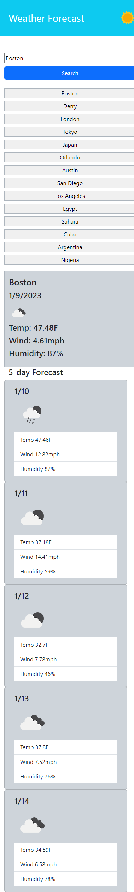

# Weather-Forecast

## Description

This simple weather forecast application will return the temperature, wind, and humidity for the current date, as well as a 5 day forecast.

## Usage

In the search bar, search for a valid city or country name. Either click the submit button or press enter to process your request. You will then see the statistics populate the page. After entering a city, the name will appear in a list directly below. Click on a previously entered city to bring up the data for that city once more.

### Image of Application 

### Link to deployed application

https://cmeesh11.github.io/Weather-Forecast/